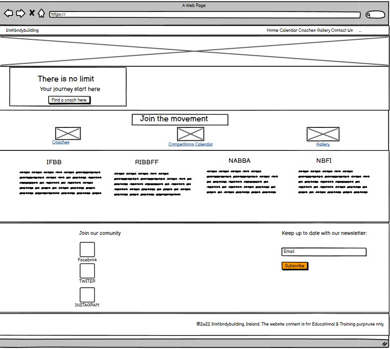

# Irishbodybuilding

Irishbodybuilding,

The Irishbodybuilding website is a landing page for new and experienced bodybuilders athlets looking for competitional performance. The Irishbodybuilding offers a guide for main bodybuilding organizations, trainers and a competitional calendar.

# UX 

I aimed for a visually appealing website that has a bodybuilding theme, the hero images theme on  Home Page   is direct related with the wesite subject, and it has a zoom animations.
The Logo on navigationbar is linked with Home Page, and all navigations items has a color transition for 2s to improve user visual experience.
The Hero Cover Text has a message with a call to action by clicking the button. On hovering the button has a pointer cursor which will call the user to click.The button will help the user to navigate straight to Coaches Page.
On the center of the page the user can access the Coaches, Calendar and Gallery page by clicking either the images or the text. The pointer cursor will show the image and text are linked with related pages.

The competitons section on Home Page is easy to read, and give some information about the main bodybuilding federations. The background is a dark image and the text is white for easy reading and visibility.

At the bottom of each page the user can easy access the media icons for Facebook, Twitter and Instagram pages, and he can subscribe to website Newsletter.

# Features

* Calendar Page

# Validator Testing

* Test Validators
    + HTML - W3C Html Validator - No errors returned when passed through .
    + CSS - W3C CSS Validator - No errors returned when passed through .    
    + RESPONSIVENESS - Am I Responsive for different devices media queries .
   

# Credits

   * Code Institute without who I would have had no base to begin a project & Readme.md Template .https://codeinstitute.net/ie/
   * GitHub for my workspace and saving all my work as well as my deployed project . https://github.com/
   
   * The Slack community - for someone always been there no matter the time and with advice or direction. https://slack.com
   * Balsamiq used to build the wireframes for my project. https://balsamiq.com
   * Google Fonts for my font choose for the project. https://fonts.google.com      
   * Free Convert - for compressing my images for better upload time . https://www.freeconvert.com/image-compressor   
   * Free Image souce https://www.pexels.com/
   * W3C Validators both HTML and CSS to keep a check on my code. The W3C Markup Validation Service [https://validator.w3.org]
 
# Copied Code / Code assistance 
* W3S School for code assistance and information. //https://www.w3schools.com/howto/howto_css_modals.asp
  Particularly the Modal Pop Ups  
* https://www.thelimitfit.com/ This is the base for my website layout I have used some ideas and adapted to my own layout.
* https://css-tricks.com/ I have use the media query inspiration.
* https://codepen.io/blackellis/pen/jObGbeG This is the base for my Coaches Page from where I have used ideas and some of the code from there I tried to adapt it as possible

# Imagery for Project

 * Images obtained 
 * Hero Background Image: https://images.pexels.com/photos/1229356/pexels-photo-1229356.jpeg?cs=srgb&dl=pexels-anush-gorak-1229356.jpg&fm=jpg
 + Competitons Background Section : https://images.pexels.com/photos/896062/pexels-photo-896062.jpeg?cs=srgb&dl=pexels-dreamlens-production-896062.jpg&fm=jpg
 + Front Coach Icon: https://images.pexels.com/photos/9073247/pexels-photo-9073247.jpeg?cs=srgb&dl=pexels-wagner-robson-9073247.jpg&fm=jpg
 + Front Competition Calendar Icon : https://images.pexels.com/photos/5518867/pexels-photo-5518867.jpeg?cs=srgb&dl=pexels-michelle-tiemann-5518867.jpg&fm=jpg
 + Front Gallery Icon : https://images.pexels.com/photos/841128/pexels-photo-841128.jpeg?cs=srgb&dl=pexels-victor-freitas-841128.jpg&fm=jpg
 + Coach Card Image : https://images.pexels.com/photos/1547248/pexels-photo-1547248.jpeg?cs=srgb&dl=pexels-pikx-by-panther-1547248.jpg&fm=jpg
 + Coach card 2 Image: https://images.pexels.com/photos/896059/pexels-photo-896059.jpeg?cs=srgb&dl=pexels-dreamlens-production-896059.jpg&fm=jpg
 + Coach card 3 Image : https://images.pexels.com/photos/1480520/pexels-photo-1480520.jpeg?cs=srgb&dl=pexels-sabel-blanco-1480520.jpg&fm=jpg
 + Coach card 4 Image: https://images.pexels.com/photos/1756959/pexels-photo-1756959.jpeg?auto=compress&cs=tinysrgb&w=1260&h=750&dpr=1
 + Coach card 5 Image: https://images.pexels.com/photos/2247179/pexels-photo-2247179.jpeg?auto=compress&cs=tinysrgb&w=1260&h=750&dpr=1
 + Coach card 6 Image: [https://images.pexels.com/photos/38630/bodybuilder-weight-training-stress-38630.jpeg?cs=srgb&dl=pexels-pixabay-38630.jpg&fm=jpg](https://images.pexels.com/photos/38630/bodybuilder-weight-training-stress-38630.jpeg?auto=compress&cs=tinysrgb&w=1260&h=750&dpr=1)
 + Gallery image 1: https://unsplash.com/photos/69bBvvFkg9I;
 + Gallery image 2: https://images.pexels.com/photos/762579/pexels-photo-762579.jpeg?cs=srgb&dl=pexels-patricia-hildebrandt-762579.jpg&fm=jpg;
 + Gallery image 3: https://c.pxhere.com/photos/59/53/bodybuilding_fitness_model-895340.jpg!d;
 + Gallery image 4: https://c.pxhere.com/photos/c3/b2/bodybuilding_fitness_model-895358.jpg!d;
 + Gallery image 5: https://c.pxhere.com/photos/0b/09/bodybuilding_fitness_model-895338.jpg!d;
 + Gallery image 6: https://c.pxhere.com/photos/d0/cc/bodybuilding_fitness_model-895353.jpg!d;
 + Gallery image 7: https://images.unsplash.com/photo-1632781297772-1d68f375d878?ixlib=rb-1.2.1&ixid=MnwxMjA3fDB8MHxwaG90by1wYWdlfHx8fGVufDB8fHx8&auto=format&fit=crop&w=627&q=80;
 + Gallery image 8: https://images.unsplash.com/photo-1619947664010-b3e60071a3c6?ixlib=rb-1.2.1&ixid=MnwxMjA3fDB8MHxwaG90by1wYWdlfHx8fGVufDB8fHx8&auto=format&fit=crop&w=687&q=80;
 
