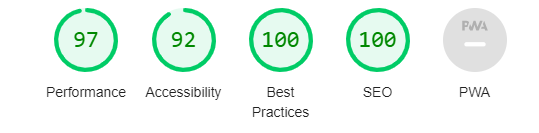

# Irishbodybuilding

Irishbodybuilding,

The Irishbodybuilding website is a landing page for new and experienced bodybuilders athlets looking for competitional performance. The Irishbodybuilding offers a guide for main bodybuilding organizations, trainers and a competitional calendar.

# Existing Features

* Navigation Bar

    + A Featured on all four pages, the full responsive navigation bar includeslinks to the Logo, Home page, Calendar, Coaches, Gallery and Contact Us page and is identical in each page to allow for easy navigation.
    + All navigations items has a color transition for 2s to improve user visual experience.
    + The navigation bar is giving a smooth navigation from page to page across all devices without having to revert back to previous page via the 'back' button.
   

* The Hero images

    + The hero images theme on  Home Page  is direct related with the wesite subject, and it has a zoom animations to grab user attention.
    + The Hero Cover Text has a message with a call to action by clicking the button. On hovering the button has a pointer cursor which will call the user to click.The button will help the user to navigate straight to Coaches Page.
    + The navigation bar is giving a smooth navigation from page to page across all devices without having to revert back to previous page via the 'back' button.
    
     
   

* The Icons  Section

    + Here the users can access the Coaches, Calendar and Gallery page by clicking either the images or the text. The pointer cursor will show the image and text are linked with related pages.

    + The user will have the chance to navigate, and find a guide form one of the coaches on coaches page, check the upcoming competiotions on calendar page, and see few picksfrom past competitions. 
   
   
   

At the bottom of each page the user can easy access the media icons for Facebook, Twitter and Instagram pages, and he can subscribe to website Newsletter.

* Competitions Section

  + The competitons section on Home Page is easy to read, and give some information about the main bodybuilding federations.
  + The background is a dark image, and the text is white for easy reading and visibility.

* Footer

  + The footer section includes links for  easy access to relevant social media sites for Irishbodybuilding. The links will open to a new tab to allow easy navigation for the user. 
  
  + The footer include a subscription form for keepuser update to the lastest newletter.
  + The encouraje the user to keep in continuos contact via diffrent channels.
  
  

* Calendar Page

+ The callendar page is very valuable for users as has a monthly calendar with upcoming competitions during the year.
+ Each competition title is linked, and open to a new tab to alow user to gather more informations from the organizing federation.

* Coaches Page

+ This page will allow the user to get in touch with a coach of his choise. He can see their picture, and check their social media profile.
+ The user will be able to contact them by social media, or by a text messaje cliking the contact us button.

* Gallery Page

+ The gallery will provide the user with supporting images to see the competitional level required.
+ This page is valuble to the user as they will be able to see the year of the competition took place and the competition name by hovering the pictures.

* Contact Us Page

+ This page will allow the user to get in touch with the irishbodybuilding team via contact form. The user will be able to introduce their name, email address and they query on designated text area.
+ The user can check for address and locate the address on the google map.
+ On desktop view the user will be able to see the full layout of the page with the address written on the left and form on the right.
+ On mobile view the user will see only the form, and the location will be reached by the google map.

# Features Left to Implement

+ The user will be able to contact the coache via a contact form. The contact form will pop-up on clicking the contact button. 

# Technologies / Support Used

* Below is a list of Technologies / Support I have used to build my site.
 
    + HTML is used to provide the structure and content of the website.
    + CSS is used via link to the HTML to provided style the pages.
    + Code Institute lessons and the Love Running assisting with my project.
    + Gitpod used to code within and provided backups of all my code.
    + GitHub for my repository and external project deployment.
    + Google Fonts for my font choose for the project.
    + Favicon.ico for adding a nice little personal touch to my page.
    + W3S Schools for code assistance and information.

# Testing

 * Testing During development of the pages was done through the project to see how the project looked and felt

  * Manual Testing

| Feature                |  Expect                      |  Action  |  Result                    |
|------------------------|------------------------------|----------|----------------------------|
|  Logo                  |  Link to home page           | Click On | Load the home page         |
| Find a coach button    |  Link to coaches page        | Click On | Load the coaches page      |
| Coach and text         |  Link to coaches page        | Click On | Load the coaches page      |
| Calendar and text      |  Link to calendar page       | Click On | Load the calendar page     |
| Gallery and text       |  Link to galery page         | Click On | Load the gallery page      |
| Social Media Icons     |  Linkto socialmedia          | Click On | New tab opened             |
| Subscribe Form         |  Post subscription           | Click on | Succesful subscribed       |
| Event link             |  Competiton Page             | Click On | Open new tab               |
| Coaches Social link    |  Link to social media profial| Click On | New tab opened             |
| Coaches contact button |  Link to social media profial| Click On | New tab opened             |
| Contact Us form        |  Post user detailand query   | Click On | Query registred            |
| Google Map             |  Get direction               | Click On | Got direction to address   |
 
* User Testing

        + Expectations
        
      As a user I wanted the site to 
      
      1. Be Visually appealing, 
      2. Easy to navigate and understand,
      3. I wanted the sources of informations to be reliable, clear,
      
    + Result
      As a user I was able to  
      1. I found it to be Visually appealing,
      2. I found it to be easy to navigate and understand,
      3. I could subscribe to newsletter,
      4. I could contact, and send a query . 

    # Validator Testing

* Test Validators

   + Testing done via gitpod and github preview.
   + Testing of the media queries was carried out via dev tools on Google Chrome.
   + HTML was tested through W3C Html validator - No errors returned when passed through .
   + CSS was tested through W3C CSS Validator - No errors returned when passed through . 
   + Responsive design media queries tested through Am I Responsive   
   + Lighthouse used to test webpage for Performance, Accessibility , Best Practice and SEO
   + Deployed project was tested in my default browser Google Chrome, as wells as Microsoft Edge, Firefox and Safari.

    

# Credits

   * Code Institute without who I would have had no base to begin a project & Readme.md Template .https://codeinstitute.net/ie/
   * GitHub for my workspace and saving all my work as well as my deployed project . https://github.com/
   
   * The Slack community - for someone always been there no matter the time and with advice or direction. https://slack.com
   * Balsamiq used to build the wireframes for my project. https://balsamiq.com
   * Google Fonts for my font choose for the project. https://fonts.google.com      
   * Free Convert - for compressing my images for better upload time . https://www.freeconvert.com/image-compressor   
   * Free image resize https://www.befunky.com/create/resize-image/
   * Free Image souce https://www.pexels.com/ , https://unsplash.com/
   * W3C Validators both HTML and CSS to keep a check on my code. The W3C Markup Validation Service [https://validator.w3.org]
 
# Copied Code / Code assistance 

* W3S School for code assistance and information. 
* https://www.thelimitfit.com/ This is the base for my website layout I have used some ideas and adapted to my own layout.
* https://css-tricks.com/ I have use the media query inspiration.
* https://codepen.io/blackellis/pen/jObGbeG This is the base for my Coaches Page from where I have used ideas and some of the code from there I tried to adapt it as possible
* Contact Form design with CSS Flexbox | CSS Flexbox Layout https://www.youtube.com/watch?v=fQfAYUrggeU I have inspiration, and adapt it to my website.

# Deployment of Project

* Deployment was made possible by GitHub

    + Initiated a repository in git :  https://fitabigail.github.io/irishbodybuilding/
    + Created all folders and files and code project
    + Go to GitHub website
    + Go to my repository in the GitHub
    + Go to Settings tab click on
    + Go to GitHub Page and linking the main root to Master Branch 
    + Once this is done the page will automatically create the ribbon with the http host page name that is been hosted by GitHub.
    The live link can be found here :  https://fitabigail.github.io/irishbodybuilding/
   

# Images for Project

 * Images obtained 
 * Hero Background Image: https://images.pexels.com/photos/1229356/pexels-photo-1229356.jpeg?cs=srgb&dl=pexels-anush-gorak-1229356.jpg&fm=jpg
 + Competitons Background Section : https://images.pexels.com/photos/896062/pexels-photo-896062.jpeg?cs=srgb&dl=pexels-dreamlens-production-896062.jpg&fm=jpg
 + Front Coach Icon: https://images.pexels.com/photos/9073247/pexels-photo-9073247.jpeg?cs=srgb&dl=pexels-wagner-robson-9073247.jpg&fm=jpg
 + Front Competition Calendar Icon : https://images.pexels.com/photos/5518867/pexels-photo-5518867.jpeg?cs=srgb&dl=pexels-michelle-tiemann-5518867.jpg&fm=jpg
 + Front Gallery Icon : https://images.pexels.com/photos/841128/pexels-photo-841128.jpeg?cs=srgb&dl=pexels-victor-freitas-841128.jpg&fm=jpg
 + Coach Card Image : https://images.pexels.com/photos/1547248/pexels-photo-1547248.jpeg?cs=srgb&dl=pexels-pikx-by-panther-1547248.jpg&fm=jpg
 + Coach card 2 Image: https://images.pexels.com/photos/896059/pexels-photo-896059.jpeg?cs=srgb&dl=pexels-dreamlens-production-896059.jpg&fm=jpg
 + Coach card 3 Image : https://images.pexels.com/photos/1480520/pexels-photo-1480520.jpeg?cs=srgb&dl=pexels-sabel-blanco-1480520.jpg&fm=jpg
 + Coach card 4 Image: https://images.pexels.com/photos/1756959/pexels-photo-1756959.jpeg?auto=compress&cs=tinysrgb&w=1260&h=750&dpr=1
 + Coach card 5 Image: https://images.pexels.com/photos/2247179/pexels-photo-2247179.jpeg?auto=compress&cs=tinysrgb&w=1260&h=750&dpr=1
 + Coach card 6 Image: [https://images.pexels.com/photos/38630/bodybuilder-weight-training-stress-38630.jpeg?cs=srgb&dl=pexels-pixabay-38630.jpg&fm=jpg](https://images.pexels.com/photos/38630/bodybuilder-weight-training-stress-38630.jpeg?auto=compress&cs=tinysrgb&w=1260&h=750&dpr=1)
 + Gallery image 1: https://unsplash.com/photos/69bBvvFkg9I;
 + Gallery image 2: https://images.pexels.com/photos/762579/pexels-photo-762579.jpeg?cs=srgb&dl=pexels-patricia-hildebrandt-762579.jpg&fm=jpg;
 + Gallery image 3: https://c.pxhere.com/photos/59/53/bodybuilding_fitness_model-895340.jpg!d;
 + Gallery image 4: https://c.pxhere.com/photos/c3/b2/bodybuilding_fitness_model-895358.jpg!d;
 + Gallery image 5: https://c.pxhere.com/photos/0b/09/bodybuilding_fitness_model-895338.jpg!d;
 + Gallery image 6: https://c.pxhere.com/photos/d0/cc/bodybuilding_fitness_model-895353.jpg!d;
 + Gallery image 7: https://images.unsplash.com/photo-1632781297772-1d68f375d878?ixlib=rb-1.2.1&ixid=MnwxMjA3fDB8MHxwaG90by1wYWdlfHx8fGVufDB8fHx8&auto=format&fit=crop&w=627&q=80;
 + Gallery image 8: https://images.unsplash.com/photo-1619947664010-b3e60071a3c6?ixlib=rb-1.2.1&ixid=MnwxMjA3fDB8MHxwaG90by1wYWdlfHx8fGVufDB8fHx8&auto=format&fit=crop&w=687&q=80;
 
 +  ### Note 
 * All information within this website is for education and training purposes only .
 * All code has been as much as possible credited to the source that the code came from 
 * I would like to thank everyone for all and any assistance given during the development of my website. 
